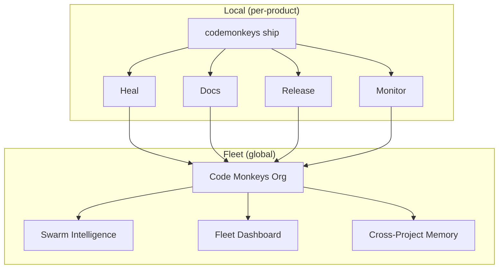

# Code Monkeys Ship

> **Code Monkeys Ship — The Solo Shipping Factory**: 
> Constitution-governed DevSecOps automation that keeps CI green, keeps docs true, and ships audited releases end-to-end—at fleet scale (50+ products), even while you’re offline.

---

## The Problem You Have

Building products is fast. **Maintaining them is slow.**

Every repo needs:

- 🔴 CI that stays green
- 📄 Docs that don't drift
- 🚀 Releases that follow rules
- ⏰ Hours of maintenance you don't have

**Code Monkeys Ship does all of it. Automatically. While you sleep.**

---

## What Code Monkeys Ship Does

<div class="grid cards" markdown>

-   :brain: **Oracle**

    ---

    Code graph + semantic indexing

-   :stethoscope: **Heal**

    ---

    Self-healing CI with LLM-powered fixes

-   :books: **Docs**

    ---

    Living documentation that stays in sync

-   :rocket: **Ship**

    ---

    Governed releases (semver, changelog, tags)

-   :package: **Publish**

    ---

    Packages (crates.io, PyPI, Docker)

-   :mega: **Announce**

    ---

    Website, release notes, marketing copy

</div>

---

## Why Code Monkeys Ship?

| Feature | Benefit |
|---------|---------|
| 🏠 **100% Local** | Your code never leaves your machine |
| 📜 **Constitution-Governed** | Every action follows your rules |
| 🔄 **Self-Healing** | Fixes CI failures automatically |
| 🌐 **Fleet-Ready** | One product or fifty. Same workflow. |

---

## Proof It Works

```
You: *sleeping*
codemonkeys ship: Detected CI failure (E0308: type mismatch)
codemonkeys ship: Generated fix via Qwen-7B
codemonkeys ship: Applied fix, verified, committed
codemonkeys ship: All tests passing ✅
You: *wake up* → Green CI, fixed code, audit log
```

### Demo It Yourself

```bash
# Create a broken test
echo 'fn broken() { let x: i32 = "oops"; }' > tests/broken.rs

# Generate failure log
cargo test --message-format=json > fail.json

# Code Monkeys Ship heals it automatically via Watch
# Or manually trigger:
codemonkeys ship heal --log-file fail.json
```

---

## Quick Start

=== "Install"

    ```bash
    cargo install codemonkeys
    ```

=== "Setup"

    ```bash
    codemonkeys init              # Bootstrap project
    codemonkeys ship              # Start Ship services
    ```

=== "Query"

    ```bash
    codemonkeys ship chat -q "What functions handle errors?"
    codemonkeys ship chat --docs -q "How do I configure CI?"
    ```

=== "Release"

    ```bash
    codemonkeys ship --dry-run    # Preview release
    codemonkeys ship release      # Cut release
    codemonkeys ship publish      # Publish to registries
    ```

---

## Commands

| Command | Description |
|---------|-------------|
| `codemonkeys ship` | Full release pipeline |
| `codemonkeys ship docs` | Generate documentation |
| `codemonkeys ship website` | Generate website |
| `codemonkeys ship ci` | Setup/update CI/CD |
| `codemonkeys ship pr` | Create PR with governance |
| `codemonkeys ship release` | Version bump + changelog |
| `codemonkeys ship publish` | Publish to registries |
| `codemonkeys ship monitor` | Setup monitoring |
| `codemonkeys ship chat` | Query codebase/docs with natural language |
| `codemonkeys ship heal` | Manually trigger CI repair |
| `codemonkeys ship watch` | Always-on daemon *(Coming)* |

---

## The Bigger Picture

Code Monkeys Ship operates at **two levels**:

### 🏠 Local (Per-Product)

Each product runs its own Ship instance:

- Heal, Docs, Release, Monitor for **this repo**
- Fully autonomous, works offline

### 🌐 Fleet (Cross-Product)

All Ship instances report to a central **Code Monkeys Org**:

- Telemetry & logs from all products
- Cross-project learning (fix in one → propagate to many)
- Unified dashboard for 50+ products
- Multi-company orchestration



| Layer | Scope | What Happens |
|-------|-------|--------------|
| **Local** | This product | Heal, Docs, Release, Monitor |
| **Fleet** | All 50+ products | Telemetry, learning, unified view |

---

## The Complete Factory

| Pillar | Command | Job |
|--------|---------|-----|
| Bootstrap | `codemonkeys init` | 0 → working repo |
| Front Half | `codemonkeys dev` | Constitution → Spec → Plan → Implement → Secure → Test |
| Back Half | `codemonkeys ship` | Heal → Docs → Release → Monitor (local + fleet) |

**You write Constitution + Spec. The system does the rest.**

---

## Requirements

- Rust 1.82+
- Ollama with `qwen2.5-coder:7b-instruct`
- ~2GB disk for models

---

## Get Started

[:octicons-arrow-right-24: Architecture](architecture.md)

[:octicons-arrow-right-24: CLI Reference](cli-reference.md)

[:octicons-arrow-right-24: Configuration](configuration.md)

[:octicons-arrow-right-24: Developer Guide](developer-guide.md)

---

<div style="text-align: center; margin-top: 2rem;">
  <strong>Built by <a href="https://novelbytelabs.com">Novel Byte Labs</a></strong><br>
  <small>Apache 2.0 License</small>
</div>
