# ArqonShip

> **The Solo Product Factory**: Constitution-governed automation that fixes bugs while you sleep, ships releases automatically, and scales to 50+ products.

---

## The Problem You Have

Building products is fast. **Maintaining them is slow.**

Every repo needs:

- 🔴 CI that stays green
- 📄 Docs that don't drift
- 🚀 Releases that follow rules
- ⏰ Hours of maintenance you don't have

**ArqonShip does all of it. Automatically. While you sleep.**

---

## What ArqonShip Does

<div class="grid cards" markdown>

-   :brain: **Oracle**

    ---

    Semantic code understanding via graph + vectors.
    Query your codebase in natural language.

-   :stethoscope: **Heal**

    ---

    LLM-powered CI repair.
    Wake up to green builds.

-   :books: **Docs**

    ---

    Living documentation.
    README never goes stale.

-   :rocket: **Ship**

    ---

    Governed releases.
    One-click publish with guardrails.

-   :eye: **Watch**

    ---

    Always-on monitoring.
    Catches issues before you do.

</div>

---

## Why ArqonShip?

| Feature | Benefit |
|---------|---------|
| 🏠 **100% Local** | Your code never leaves your machine |
| 📜 **Constitution-Governed** | Every action follows your rules |
| 🔄 **Self-Healing** | Fixes CI failures automatically |
| 🌐 **Fleet-Ready** | One product or fifty. Same workflow. |

---

## Proof It Works

```
You: *sleeping*
ArqonShip: Detected CI failure (E0308: type mismatch)
ArqonShip: Generated fix via Qwen-7B
ArqonShip: Applied fix, verified, committed
ArqonShip: All tests passing ✅
You: *wake up* → Green CI, fixed code, audit log
```

### Demo It Yourself

```bash
# Create a broken test
echo 'fn broken() { let x: i32 = "oops"; }' > tests/broken.rs

# Generate failure log
cargo test --message-format=json > fail.json

# Watch ArqonShip fix it
arqonship heal --log-file fail.json
```

---

## Quick Start

=== "Install"

    ```bash
    cargo install --path .
    ```

=== "Initialize"

    ```bash
    arqonship init
    arqonship scan
    ```

=== "Query"

    ```bash
    arqonship chat -q "What functions handle errors?"
    ```

=== "Heal"

    ```bash
    cargo test --message-format=json > test.json
    arqonship heal --log-file test.json
    ```

=== "Ship"

    ```bash
    arqonship ship --dry-run
    ```

---

## Commands

| Command | Description |
|---------|-------------|
| `arqonship init` | Initialize ArqonShip in current repo |
| `arqonship scan` | Build Codebase Oracle |
| `arqonship chat` | Query codebase with natural language |
| `arqonship heal` | Autonomous self-healing |
| `arqonship ship` | Governed release pipeline |
| `arqonship watch` | *(Coming)* Always-on daemon |

---

## The Bigger Picture

ArqonShip is part of a complete product factory:

```mermaid
graph TD
    A[ArqonInit] -->|Bootstrap| B[ArqonDev]
    B -->|Spec → Code| C[ArqonShip]
    C -->|Heal + Ship| D[ArqonOrg]
    D -->|Fleet Management| E[50+ Products]
```



| Layer | Product | Job |
|-------|---------|-----|
| Bootstrap | **ArqonInit** | 0 → working repo |
| Front Half | **ArqonDev** | Spec → Plan → Tasks |
| Back Half | **ArqonShip** | Heal → Docs → Ship |
| Fleet | **ArqonOrg** | Multi-company orchestration |

**You write Constitution + Spec. The system does the rest.**

---

## Requirements

- Rust 1.82+
- Ollama with `qwen2.5-coder:7b-instruct`
- ~2GB disk for models

---

## Get Started

[:octicons-arrow-right-24: Architecture](architecture.md)

[:octicons-arrow-right-24: CLI Reference](cli-reference.md)

[:octicons-arrow-right-24: Configuration](configuration.md)

[:octicons-arrow-right-24: Developer Guide](developer-guide.md)

---

<div style="text-align: center; margin-top: 2rem;">
  <strong>Built by <a href="https://novelbytelabs.com">Novel Byte Labs</a></strong><br>
  <small>Apache 2.0 License</small>
</div>
